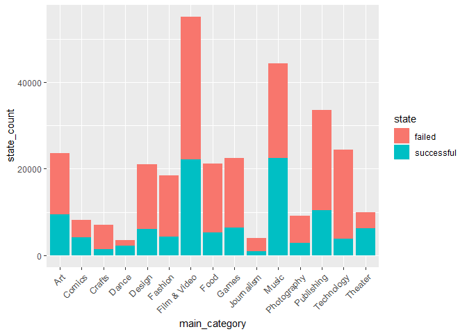

Deliverable1
================

R Markdown
----------

``` r
library(tidyverse)
```

    ## -- Attaching packages --------------------------------------- tidyverse 1.2.1 --

    ## v ggplot2 3.1.0     v purrr   0.2.5
    ## v tibble  2.0.1     v dplyr   0.7.8
    ## v tidyr   0.8.2     v stringr 1.3.1
    ## v readr   1.3.1     v forcats 0.3.0

    ## -- Conflicts ------------------------------------------ tidyverse_conflicts() --
    ## x dplyr::filter() masks stats::filter()
    ## x dplyr::lag()    masks stats::lag()

``` r
KSData2018 <- read_csv("kickstarter-projects/ks-projects-201801.csv")#, col_types = cols(state = col_factor()))
```

    ## Parsed with column specification:
    ## cols(
    ##   ID = col_double(),
    ##   name = col_character(),
    ##   category = col_character(),
    ##   main_category = col_character(),
    ##   currency = col_character(),
    ##   deadline = col_date(format = ""),
    ##   goal = col_double(),
    ##   launched = col_datetime(format = ""),
    ##   pledged = col_double(),
    ##   state = col_character(),
    ##   backers = col_double(),
    ##   country = col_character(),
    ##   `usd pledged` = col_double(),
    ##   usd_pledged_real = col_double(),
    ##   usd_goal_real = col_double()
    ## )

``` r
problems(KSData2018)
```

    ## [1] row      col      expected actual  
    ## <0 rows> (or 0-length row.names)

``` r
KSData2018
```

    ## # A tibble: 378,661 x 15
    ##        ID name  category main_category currency deadline     goal
    ##     <dbl> <chr> <chr>    <chr>         <chr>    <date>      <dbl>
    ##  1 1.00e9 The ~ Poetry   Publishing    GBP      2015-10-09   1000
    ##  2 1.00e9 Gree~ Narrati~ Film & Video  USD      2017-11-01  30000
    ##  3 1.00e9 Wher~ Narrati~ Film & Video  USD      2013-02-26  45000
    ##  4 1.00e9 Tosh~ Music    Music         USD      2012-04-16   5000
    ##  5 1.00e9 Comm~ Film & ~ Film & Video  USD      2015-08-29  19500
    ##  6 1.00e9 Mona~ Restaur~ Food          USD      2016-04-01  50000
    ##  7 1.00e9 Supp~ Food     Food          USD      2014-12-21   1000
    ##  8 1.00e9 Chas~ Drinks   Food          USD      2016-03-17  25000
    ##  9 1.00e9 SPIN~ Product~ Design        USD      2014-05-29 125000
    ## 10 1.00e8 STUD~ Documen~ Film & Video  USD      2014-08-10  65000
    ## # ... with 378,651 more rows, and 8 more variables: launched <dttm>,
    ## #   pledged <dbl>, state <chr>, backers <dbl>, country <chr>, `usd
    ## #   pledged` <dbl>, usd_pledged_real <dbl>, usd_goal_real <dbl>

``` r
KSData2018 <- KSData2018 %>% mutate(prop_raised_goal = usd_pledged_real/usd_goal_real)


#Filtering by prop < 2 only eliminates ~20,000 entries of the 378,654 entries
KSDataFiltered <- KSData2018 %>% filter(prop_raised_goal < 2 & (state == "failed" | state == "successful")) %>% group_by(main_category, state) %>% summarize(state_count = n()) %>%
  ungroup() %>% group_by(main_category) %>% mutate(total = sum(state_count)) %>% mutate(succ_prop = ifelse(state == "successful", state_count/total, 1-state_count/total)) %>% ungroup()


KSDataFiltered
```

    ## # A tibble: 30 x 5
    ##    main_category state      state_count total succ_prop
    ##    <chr>         <chr>            <int> <int>     <dbl>
    ##  1 Art           failed           14131 23657     0.403
    ##  2 Art           successful        9526 23657     0.403
    ##  3 Comics        failed            4036  8157     0.505
    ##  4 Comics        successful        4121  8157     0.505
    ##  5 Crafts        failed            5703  7110     0.198
    ##  6 Crafts        successful        1407  7110     0.198
    ##  7 Dance         failed            1235  3507     0.648
    ##  8 Dance         successful        2272  3507     0.648
    ##  9 Design        failed           14814 20966     0.293
    ## 10 Design        successful        6152 20966     0.293
    ## # ... with 20 more rows

``` r
#KSData2018
```

Including Plots
---------------

You can also embed plots, for example:



Note that the `echo = FALSE` parameter was added to the code chunk to prevent printing of the R code that generated the plot.
