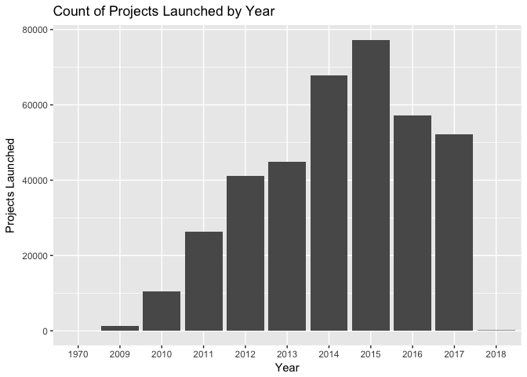
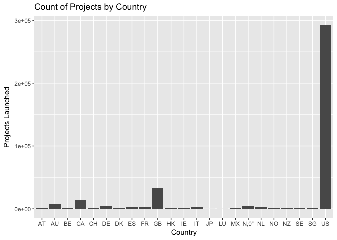

Deliverable1
================

Count of Projects Launched by Year
----------------------------------

``` r
library(tidyverse)
```

    ## ── Attaching packages ────────────────────────────────────────────────────────────────────────────────────────────────────── tidyverse 1.2.1 ──

    ## ✔ ggplot2 2.2.1     ✔ purrr   0.2.5
    ## ✔ tibble  1.4.2     ✔ dplyr   0.7.8
    ## ✔ tidyr   0.7.2     ✔ stringr 1.3.0
    ## ✔ readr   1.3.1     ✔ forcats 0.3.0

    ## Warning: package 'ggplot2' was built under R version 3.3.2

    ## Warning: package 'tidyr' was built under R version 3.3.2

    ## ── Conflicts ───────────────────────────────────────────────────────────────────────────────────────────────────────── tidyverse_conflicts() ──
    ## ✖ dplyr::filter() masks stats::filter()
    ## ✖ dplyr::lag()    masks stats::lag()

``` r
project <- read_csv("ks-projects-201801.csv")
```

    ## Parsed with column specification:
    ## cols(
    ##   ID = col_double(),
    ##   name = col_character(),
    ##   category = col_character(),
    ##   main_category = col_character(),
    ##   currency = col_character(),
    ##   deadline = col_date(format = ""),
    ##   goal = col_double(),
    ##   launched = col_datetime(format = ""),
    ##   pledged = col_double(),
    ##   state = col_character(),
    ##   backers = col_double(),
    ##   country = col_character(),
    ##   `usd pledged` = col_double(),
    ##   usd_pledged_real = col_double(),
    ##   usd_goal_real = col_double()
    ## )

``` r
# Launched
library(stringr)
?str_sub
project %>% mutate(yearlaunched = str_sub(launched, start = 1, end = 4)) %>% ggplot() + geom_bar(aes(x = yearlaunched)) + labs (x = 'Year', y = 'Projects Launched', title = 'Count of Projects Launched by Year' )
```



``` r
#There were 7 projects launched in the year 1970. We opt to exclude these outliers in our analysis, as we feel they do not adequately represent the modern kickstarter climate. 
```

Count of Projects per Country
-----------------------------

``` r
project %>% ggplot() + geom_bar(aes(x = country)) + labs (x = 'Country', y = 'Projects Launched', title = 'Count of Projects by Country' )
```


