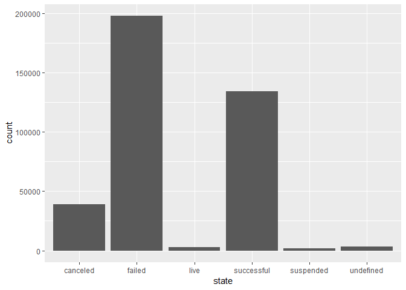
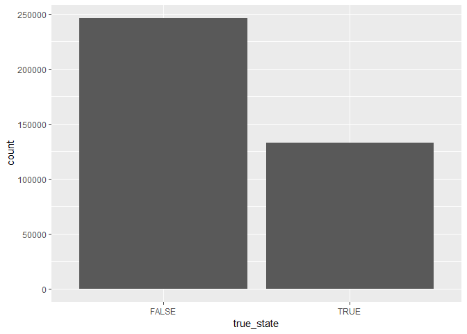

Deliverable1
================
Cathy Kim, Leo McGann, Anastacia Wahl, Stefan Wenc | SWACK

Abstract
--------

The aim of this document is to summarize the early exploration and data analysis performed for our final project. In this project, we seek to investigate the determinants of kickstarter project success. Below, we describe our dataset and variables of interest, state our research question, and describe and summarize the Exploratory Data Analysis (EDA) performed.

Data Description
----------------

This dataset is a collection of data on Kickstarter projects, a website that allows companies and individuals to request and receive funding from individuals for their projects or goals. This dataset came from Kaggle, and was gathered by a user named Mickael Mouille. The dataset has information about 378,661 kickstarter projects on 15 variables. Those variables are:

1.  ID: a unique ID number for each project (categorical)

2.  Name: the name of the project inputted by the person or organization seeking to raise funds (categorical)

3.  Category: a categorical variable that places each project into a category of fundraising (categorical)

4.  Main\_Category: a categorical variable that places each project into a broader category of project type than the Category variable (categorical)

5.  Currency: a categorical variable on the type of currency the user is fundraising in and that their goal is measured in (categorical)

6.  Deadline: the deadline by which the fundraiser is seeking to meet their fundraising goal (continuous)

7.  Goal: the amount of the given currency that the fundraiser is seeking to raise (continuous)

8.  Launched: the date and time that the project was posted and began (continuous)

9.  Pledged: the amount of money in the given currency the kickstarter project raised between its launch date and deadline (continuous)

10. State: whether or not the project was successful in reaching the goal set by the fundraiser (categorical)

11. Backers: the number of people who donated to the kickstarter project (continuous)

12. Country: the country that the kickstarter project is located in (categorical)

13. USD Pledged: the amount of money pledged to the kickstarter project in US Dollars, as converted by Kickstarter (continuous)

14. USD\_pledged\_real: the amount of money pledged to the kickstarter project in US Dollars, as converted by the Fixer.io API for currency exchange rates (continuous)

15. USD\_goal\_real: the amount of money set as the goal for the kickstarter project in US Dollars, as converted by the Fixer.io API for currency exchange rates (continuous)

Research Question
-----------------

How does success of a kickstarter project depend on duration, goal, and category of project? Additionally, what other variables impact the success of kickstarter projects (ex. Title keywords, month of launch, year of launch)?

This research question is of importance because it will allow us to better understand what leads to success in a kickstarter project, allowing people who want to perform kickstarter projects in the future the opportunity to use these conclusions to optimize their projects.

Data Import
-----------

``` r
library(tidyverse)
```

    ## -- Attaching packages -------------------------------------------------------------------------------------------------------- tidyverse 1.2.1 --

    ## v ggplot2 3.1.0     v purrr   0.2.5
    ## v tibble  2.0.1     v dplyr   0.7.8
    ## v tidyr   0.8.2     v stringr 1.3.1
    ## v readr   1.3.1     v forcats 0.3.0

    ## -- Conflicts ----------------------------------------------------------------------------------------------------------- tidyverse_conflicts() --
    ## x dplyr::filter() masks stats::filter()
    ## x dplyr::lag()    masks stats::lag()

``` r
kickstarters <- read.csv("kickstarter-projects/ks-projects-201801.csv")
problems(kickstarters)
```

    ## [1] row      col      expected actual  
    ## <0 rows> (or 0-length row.names)

The data import process went smoothly, with no errors found when using problems() to parse the data.

``` r
kickstarters2 <- kickstarters %>% mutate(proportion_raised = (usd_pledged_real/usd_goal_real)) %>% mutate(true_state = (proportion_raised) > 1) 
```

Added a proportion\_raised variable to the data set to display the proportion of the total goal that was met. Added a true\_state variable to split projects into success/failure based on the amount of money raised and whether or not the goal was met. For this variable, TRUE is equivalent to successful, and FALSE is equivalent to FAILED.

Exploratory Data Analysis: Single Variable
------------------------------------------

``` r
kickstarters2 %>% ggplot(aes(x = state)) + geom_bar()
```



``` r
kickstarters2 %>% ggplot(aes(x = true_state)) + geom_bar()
```

 These two bar graphs show that overall, the highest number of the projects end up as failed, and the majority of projects do not meet their eventual goals.
